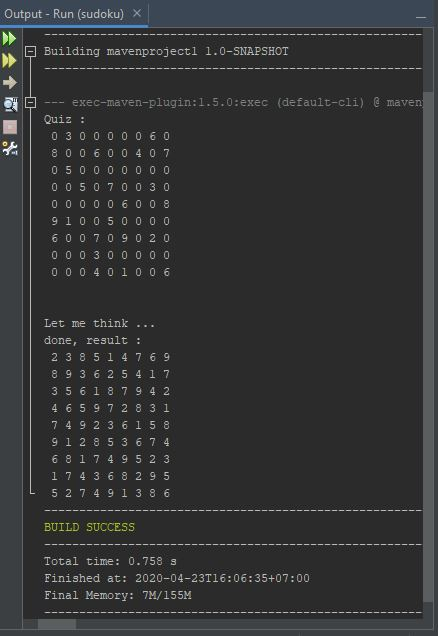

# Simple Java Sudoku Resolver

## What is it?
  It's a Simple code that try to resolve up to 9x9 sudoku. It only check horizontal
  and vertical lines. Diagonal and other rules didn't supported yet.

## How To Use?
  - Edit variable row_coloumn to match your table
  - Edit tabel 2d Array and write the quiz. 0 means empty / something will replaced
  by computer.

## Screenshot
  

  
  

## Lisensi

[GNU General Public License](https://www.gnu.org/licenses/gpl-3.0.html).
